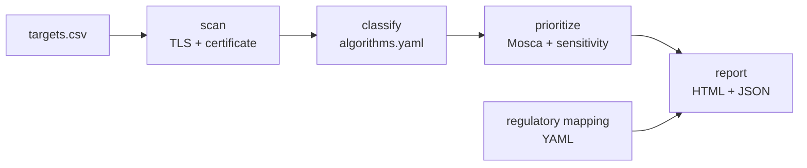

# pqready

**Quantum readiness scanner for TLS endpoints: from crypto inventory to prioritized, regulation-aware migration plan.**


---

## The problem

- A cryptographically relevant quantum computer (CRQC) will break **RSA, Diffie-Hellman and elliptic-curve cryptography** (Shor's algorithm).
- **Harvest now, decrypt later:** encrypted traffic recorded today can be decrypted once a CRQC exists. Data that must stay confidential for years is already exposed.
- **European guidance has also defined target dates for the transition to post-quantum cryptography.** The EU coordinated PQC roadmap (June 2025) asks for first steps and a crypto inventory by end of 2026, and migration of high-risk use cases by end of 2030. A first step in the migration process is to identify **where and which cryptography is being used**.

## What pqready does

`pqready` scans TLS endpoints, identifies cryptographic weaknesses, and assigns a migration priority based on **quantum risk** and **data sensitivity**

1. **Scan**: TLS versions, negotiated key exchange group, post-quantum hybrid support (`X25519MLKEM768`), cipher suites, certificate (key type and size, signature algorithm, expiry).
2. **Classify**: each element is flagged as *quantum-vulnerable*, *quantum-resistant*, or *classical weakness*, using a transparent rule table
3. **Prioritize**: each endpoint gets a **P0–P3** priority based on data sensitivity, confidentiality lifetime and **Mosca's inequality**, with a one-sentence justification.
4. **Report**: a standalone report (executive summary, top priorities, per-asset details, regulatory mapping, methodology and limits)

### Why not just SSL Labs or testssl.sh?

Those tools are excellent at **technical inventory**. `pqready` adds the layer on top: **quantum risk, prioritization and regulatory mapping**, with a focus on post-quantum risk and migration priorities.

## Who it's for

Security and risk teams in **regulated organizations** (banks, insurers, critical infrastructure), starting with the EU/French regulatory context.

## How prioritization works

**Mosca's inequality:** if **X + Y > Z**, data will still be sensitive when a quantum computer can decrypt it

| Variable | Meaning | Source |
|---|---|---|
| X | Years the data must stay confidential | Per endpoint, input CSV |
| Y | Years needed to migrate | Parameter (default: 3) |
| Z | Years until a CRQC exists | **Scenario assumption** (default: 2035) |

| Priority | Rule |
|---|---|
| **P0 Critical** | Classical weakness (TLS < 1.2, RSA < 2048, SHA-1, expired certificate, RSA key exchange). Fix now, quantum or not. |
| **P1 High** | Non-hybrid key exchange **and** Mosca violated **and** sensitivity ≥ medium. Exposed to harvest-now-decrypt-later. |
| **P2 Medium** | Non-hybrid key exchange, P1 conditions not met. Include in migration plan. |
| **P3 Low** | Hybrid PQC key exchange in place. Plan certificate signature migration. |

The priority is based on explicit rules, making the reason for each classification visible

## Architecture




## Planned usage

```bash
pqready scan targets.csv -o results.json
pqready report results.json -o report.html
```

Runs in Docker (requires OpenSSL ≥ 3.5 for post-quantum group detection).

## Scope

**V1**
- TLS endpoints (host + port) from a CSV file
- Leaf certificate + chain summary
- Rule-based classification and prioritization
- HTML report + JSON export
- Automated tests against a Docker lab (classical, hybrid PQC, and deliberately weak servers)

**Out of scope for V1**: SSH, VPN/IPsec, source code analysis, CycloneDX CBOM export, web UI.


## Limitations

`pqready` sees what an external TLS client sees. It does **not** see internal cryptography, application code, HSMs, or data at rest. The CRQC date (Z) is an assumption, not a prediction.

## Responsible use

`pqready` performs standard TLS handshakes only, the same as a browser. No exploitation, no intrusive testing. Scan only systems you own or public endpoints, at a limited rate. Published results are aggregated only: no named entities.

## References

- NIST, [FIPS 203 / 204 / 205](https://csrc.nist.gov/Projects/Post-Quantum-Cryptography) (ML-KEM, ML-DSA, SLH-DSA), August 2024
- NIST, [IR 8547 (initial public draft)](https://nvlpubs.nist.gov/nistpubs/ir/2024/NIST.IR.8547.ipd.pdf): Transition to Post-Quantum Cryptography Standards
- NIS Cooperation Group, [Coordinated Implementation Roadmap for the Transition to PQC](https://digital-strategy.ec.europa.eu/en/policies/post-quantum-cryptography), June 2025
- OpenSSL, [Post-quantum readiness](https://openssl-corporation.org/post-quantum.html)

## License

[MIT](LICENSE)

---